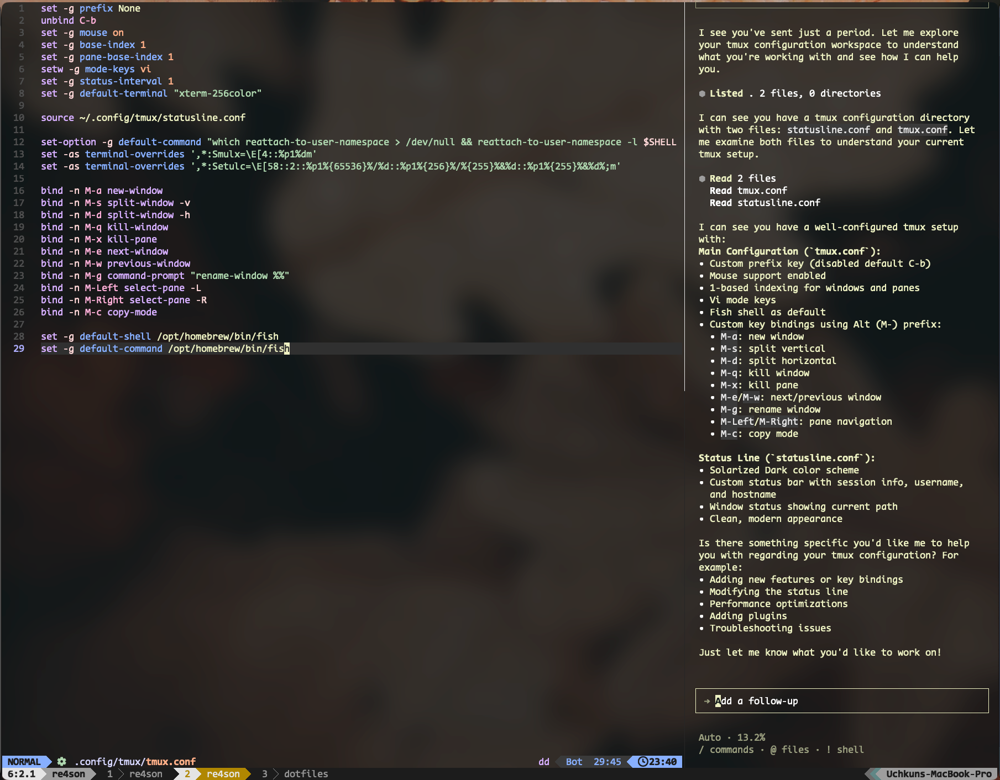

# Dotfiles

Personal configuration files and development environment setup.

## Overview

This repository contains my personal dotfiles and configuration scripts for setting up a consistent development environment across machines.

## What's Included

- Shell configurations
- Editor settings
- Git configuration
- Development tools setup
- System preferences

## Installation

The installation script will:
- Create necessary symlinks
- Install required dependencies
- Set up development environment

## License

MIT License - see [LICENSE](LICENSE) for details.

---

*Maintained by [Uchkun Rakhimov](https://github.com/uchkun)*
